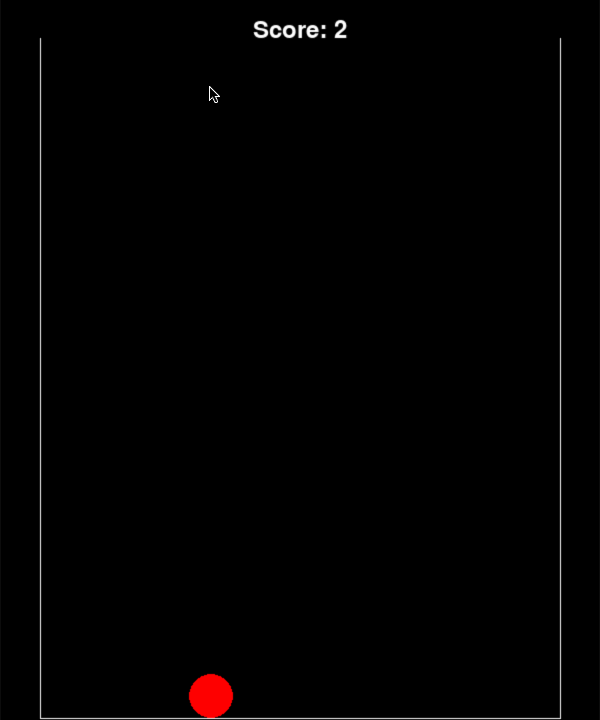

# Watermelon-game-copy
 This project aims is to copy suica game (watermelon game) using pygame

## Suica game
[What is suica game](https://www.youtube.com/watch?v=_o-7KLragfQ)

## Rules
- place ball using mouse
- you can only place ball above the dotted line
- if the balls stack up to the dotted line, you lose
- two same color balls will combined into one larger ball and score will be added

## GIF
